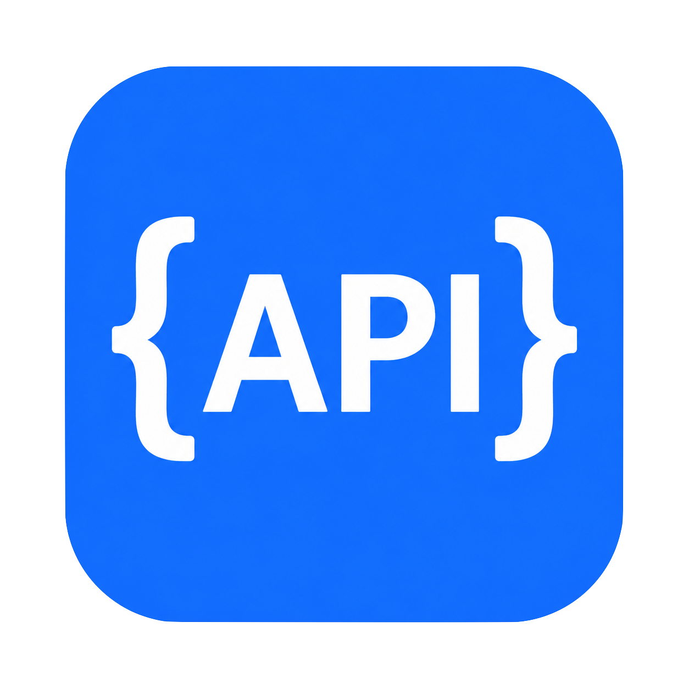
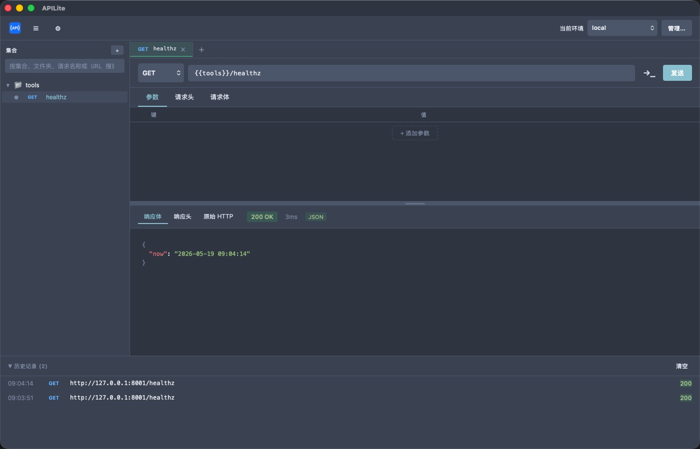

<p align="center">
  
</p>

<h1 align="center">APILite</h1>

<p align="center">
  一款基于 Tauri（Rust）和 React 构建的轻量级桌面 HTTP 客户端<br>提供类似 Postman 的界面，用于发送、测试和管理 API 请求。
</p>

<p align="center">
  <a href="README.md">English</a>
</p>

<p align="center">
  <picture>
    
  </picture>
</p>

## 目录

- [目录](#目录)
- [快速开始](#快速开始)
  - [从源码构建](#从源码构建)
  - [项目结构](#项目结构)
- [界面概览](#界面概览)
- [环境变量](#环境变量)
- [Pre 请求脚本（Python）](#pre-请求脚本python)
- [保存请求到文件夹](#保存请求到文件夹)
- [发送请求](#发送请求)
  - [发送步骤](#发送步骤)
  - [URL 输入](#url-输入)
- [查询参数](#查询参数)
  - [自动识别](#自动识别)
  - [手动编辑](#手动编辑)
- [请求头](#请求头)
  - [自动补全](#自动补全)
- [请求体](#请求体)
- [响应面板](#响应面板)
- [cURL 导入与导出](#curl-导入与导出)
  - [导入 cURL](#导入-curl)
  - [导出 cURL](#导出-curl)
- [请求历史](#请求历史)
- [设置](#设置)
  - [语言](#语言)
  - [主题](#主题)
  - [拖拽分割线](#拖拽分割线)
  - [本地存储](#本地存储)
  - [历史记录保留](#历史记录保留)
  - [快捷键](#快捷键)

---

## 快速开始

### 从源码构建

```bash
# 安装依赖
npm install

# 启动开发模式
npm run tauri dev
```

### 项目结构

```plain text
APILite/
├── src-tauri/           # Rust 后端
│   ├── src/
│   │   ├── main.rs          # Tauri 入口与命令注册
│   │   ├── curl_parser.rs   # cURL 命令解析
│   │   ├── curl_export.rs   # cURL 命令生成
│   │   ├── http_client.rs   # HTTP 请求引擎
│   │   ├── histories.rs     # 历史记录持久化（按日分片）
│   │   ├── storage.rs       # 数据目录结构
│   │   ├── environments.rs  # 环境变量文件
│   │   ├── folders.rs       # 磁盘上的已保存请求树
│   │   ├── scripts.rs       # Pre 请求脚本清单与文件
│   │   └── script_runner.rs # Python venv 运行器
│   ├── Cargo.toml
│   └── tauri.conf.json
├── frontend/            # React + TypeScript 前端
│   └── src/
│       ├── App.tsx
│       ├── components/      # UI（标题栏、标签、面板、弹窗等）
│       ├── store/           # Zustand 状态管理
│       ├── i18n.ts          # 国际化
│       ├── themes.ts        # 主题定义
│       └── constants.ts     # 请求头提示
```

---

## 界面概览

| 区域           | 说明                                                                                      |
| -------------- | ----------------------------------------------------------------------------------------- |
| **标题栏**       | 切换文件夹（左）、历史（下）、cURL（右）面板，以及设置（⚙）。macOS 下与系统标题栏叠加显示。 |
| **标签栏**       | 请求标签、**+** 新建标签、环境下拉与管理（⚙）。                                             |
| **文件夹侧栏**   | 可选左侧面板 — 文件夹与已保存请求的树形结构。                                               |
| **地址栏**     | HTTP 方法、URL、**发送**。                                                                |
| **请求编辑器** | **参数**、**请求头**、**请求体**、**Pre 脚本** 标签页（脚本仅桌面版）。                   |
| **响应面板**   | 状态码、耗时、响应体 / 响应头 / 原始 HTTP；请求进行中显示加载遮罩。                       |
| **cURL 面板**  | 可选右侧面板 — 当前请求的实时 cURL，支持**复制**。                                        |
| **历史面板**   | 可选底部停靠区 — 持久化历史记录；可拖拽上边缘调整高度。                                   |

请求/响应、文件夹侧栏、cURL 面板与历史停靠区之间均为细分割线（与历史面板上边缘样式一致）。

---

## 环境变量

在**标签栏**右侧选择环境。在 URL、参数、请求头、请求体中使用 `{{变量名}}`，发送时自动替换。点击下拉框旁的 **⚙** 管理多环境变量（同一环境内可用 `{{其他变量}}` 相互引用）。

---

## Pre 请求脚本（Python）

**仅桌面版（Tauri）可用。** 在每次 HTTP 请求发出**之前**，可运行 Python **Pre 请求**脚本，用于设置变量和/或修改即将发送的请求。脚本在全局共享：多个标签页或已保存请求可绑定同一脚本 ID。

### 环境准备

1. 打开 **设置 → 本地存储**，确认数据目录（默认 `~/.APILite`）。
2. 在 scripts 目录创建虚拟环境：

   ```bash
   cd ~/.APILite/scripts
   python3 -m venv .venv
   ```

3. 在虚拟环境中安装所需依赖（例如 `pip install requests`）。

应用会自动在 `scripts/` 下生成运行器 `.apilite_runner.py`。用户脚本为同目录下的 `.py` 文件，清单保存在 `scripts.json`（名称、备注、文件路径）。

### 管理脚本

1. 在请求编辑器打开 **Pre 脚本** 标签页。
2. 点击 **管理脚本** 打开脚本管理器：新建脚本、填写**名称**与**备注**、编辑 Python 源码、保存或删除。
3. 管理器会显示是否检测到 `.venv` 以及 scripts 目录路径。

### 为请求绑定脚本

在 **Pre 脚本** 标签页的下拉框中选择脚本（或选 **无**）。绑定保存在请求的 `preScriptId` 字段中，随文件夹请求一并持久化。该页还会列出当前标签页由脚本写入的**脚本变量**。

### 执行时机

点击 **发送** 时（HTTP 之前）：

1. 合并**环境变量**与当前标签页的**脚本变量**（同名时脚本变量优先）。
2. 运行所选 Pre 脚本。
3. 若脚本返回 `ok: false` 或执行异常，**中止发送**并提示错误。
4. 将返回的 `vars` 并入本次 `{{变量名}}` 插值，并写入标签页供后续请求使用。
5. 应用返回的 `request` 补丁（URL、方法、请求头、请求体、body 类型）。
6. 解析占位符并发送 HTTP 请求。

响应区显示的耗时**仅包含 HTTP 往返**，不含 Pre 脚本执行时间。脚本由常驻 Python 进程执行并缓存已加载模块，避免每次请求冷启动 Python。

当前仅支持 **Pre 请求**脚本，不在 HTTP 响应返回后执行脚本。

### 脚本约定

每个 `.py` 文件需定义：

```python
def run(ctx):
    ...
    return {"ok": True, "vars": {}, "request": {}}
```

**`ctx`**（传入 Python 的 JSON）：

| 字段        | 说明 |
| ----------- | ---- |
| `phase`     | 固定为 `"pre"`。 |
| `request`   | 当前请求：`method`、`url`、`headers`（字典）、`bodyType`。JSON/JSONC 时 `body` 为去掉注释后的严格 JSON 字符串，`bodyJson` 为解析后的对象；无效时为 `bodyParseError`。签名/处理逻辑请优先用 `bodyJson`。 |
| `env`       | 当前激活环境的变量表。 |
| `vars`      | 本标签页脚本变量与环境变量合并结果（同名时脚本优先）。 |

**返回值**（stdout 输出 JSON）：

| 字段       | 必填 | 说明 |
| ---------- | ---- | ---- |
| `ok`       | 是   | `true` 继续发送；`false` 取消发送。 |
| `vars`     | 否   | 并入本次发送的 `{{name}}`，并保存在标签页。 |
| `request`  | 否   | 部分更新：`url`、`method`、`headers`（字典）、`body`、`bodyType`。 |
| `error`    | 否   | `ok` 为 `false` 时的错误信息。 |

### 示例

```python
def run(ctx):
    req = ctx.get("request", {})
    token = ctx.get("vars", {}).get("token") or "demo-token"
    headers = dict(req.get("headers") or {})
    headers["Authorization"] = f"Bearer {token}"
    return {
        "ok": True,
        "vars": {"token": token},
        "request": {
            "headers": headers,
        },
    }
```

### 磁盘文件

数据目录下：

- `scripts/scripts.json` — 脚本清单（id、名称、备注、文件名）
- `scripts/*.py` — 脚本源码
- `scripts/.venv/` — Python 虚拟环境（需自行创建）
- `scripts/.apilite_runner.py` — 加载器（自动生成）

---

## 保存请求到文件夹

1. 配置好请求后，按 **⌘ S** / **Ctrl+S**（或在文件夹侧栏中保存）。
2. 填写**请求名称**。
3. 在文件夹浏览区用 **▶** / **▾** 逐层展开，单击选中目标文件夹后点**保存**（或双击文件夹直接保存）。
4. 树上方的按钮会随选中状态切换：**新建文件夹**（未选中时）/ **新建子文件夹**（已选中文件夹时）；点击树空白处可取消选中。

---

## 发送请求

### 发送步骤

1. 从下拉菜单选择 HTTP 方法（GET、POST、PUT、PATCH、DELETE、HEAD、OPTIONS）。
2. 在地址栏输入请求 URL。
3. 可选：通过下方标签页配置参数、请求头或请求体。
4. 点击 **发送** 按钮或按 **⌘ Enter**（macOS）/ **Ctrl+Enter**（Windows 与 Linux）。

### URL 输入

地址栏支持以下格式：

- 标准 HTTP/HTTPS URL（如 `https://httpbin.org/get`）
- 带查询参数的 URL（如 `https://httpbin.org/get?foo=bar&baz=qux`）
- cURL 命令（粘贴以 `curl` 开头的文本时自动识别）

---

## 查询参数

### 自动识别

当输入带查询字符串的 URL（如 `?key1=val1&key2=val2`）时，APILite 会自动解析并填充到**参数**表格中。

### 手动编辑

切换到**参数**标签页，可以：

- **添加**参数：在最后一行空白键/值中输入（会自动出现新的空白行）
- **编辑**参数：直接在键/值单元格中输入
- **删除**参数：点击 × 按钮
- **启用/禁用**参数：使用复选框

参数表格中的修改会实时同步到地址栏。

---

## 请求头

切换到**请求头**标签页可以配置请求头。

### 自动补全

在键名输入框中输入时，APILite 会从内置的常用 HTTP 请求头列表中弹出匹配建议：

| 请求头          | 说明                     |
| --------------- | ------------------------ |
| `Accept`        | 客户端可接受的媒体类型   |
| `Content-Type`  | 请求体媒体类型           |
| `Authorization` | 认证凭据（Bearer Token） |
| `User-Agent`    | 客户端软件标识           |
| `Cookie`        | HTTP Cookie              |
| `Origin`        | 请求来源（CORS）         |
| `X-Api-Key`     | API 密钥认证             |

使用方向键浏览建议，按 Enter 选择。

---

## 请求体

切换到**请求体**标签页可以配置请求体。支持以下格式：

| 格式                      | Content-Type                        | 说明                          |
| ------------------------- | ----------------------------------- | ----------------------------- |
| **无**                    | —                                   | 不发送请求体                  |
| **原始**                  | —                                   | 原始文本，不设置 Content-Type |
| **JSON**                  | `application/json`                  | JSON 格式数据                 |
| **XML**                   | `application/xml`                   | XML 格式数据                  |
| **文本**                  | `text/plain`                        | 纯文本                        |
| **HTML**                  | `text/html`                         | HTML 内容                     |
| **表单数据**              | `multipart/form-data`               | 键值表格，支持文本或文件字段  |
| **x-www-form-urlencoded** | `application/x-www-form-urlencoded` | 键值表格，自动 URL 编码       |
| **二进制**                | `application/octet-stream`          | 单个文件作为原始请求体        |

**表单数据**与 **x-www-form-urlencoded** 在请求体标签页通过键值表编辑（勾选启用）。文件字段可选取本地文件（桌面端为系统对话框，浏览器为文件选择器）。**原始** 子类型（JSON、XML 等）提供占位模板。

---

## 响应面板

发送请求后，响应面板显示：

- **状态码** — 彩色标签（2xx 绿色、3xx 黄色、4xx/5xx 红色）
- **耗时** — 响应时间（毫秒）
- **响应体** — 自动格式化 JSON 的响应内容
- **响应头** — 响应头的键值表格
- **原始 HTTP** — 完整原始响应

请求进行中时，响应区域会显示半透明加载遮罩（下方仍可隐约看到上一次响应）。

---

## cURL 导入与导出

### 导入 cURL

将完整的 `curl …` 命令粘贴到**地址栏**（或先聚焦地址栏再粘贴）。识别到 `curl` 后会自动解析并填充：

- HTTP 方法（`-X`）
- URL
- 请求头（`-H`）
- 请求体（`-d`、`--data`、`--data-raw`、`--data-binary`、`--data-urlencode`）

若未自动应用，可在地址栏按 **Enter**。

### 导出 cURL

1. 从标题栏打开 **cURL** 面板（右侧面板图标）。
2. 编辑请求 — 命令会实时更新。
3. 在面板中点击**复制**。

生成的 cURL 包含必要的 `-X`、完整 URL、`-H`、请求体（`-d`、`--data-binary` 或文件字段 `-F`），并在 JSON/XML 缺少时补全 `Content-Type`。

---

## 请求历史

通过标题栏或 **Ctrl+`**（各平台均为物理 Control 键）切换底部历史面板。面板记录最近发送的请求：

- **时间** — 请求发送时间
- **方法** — 彩色 HTTP 方法标签
- **URL** — 完整请求 URL
- **状态** — 响应状态码

展开行可查看原始请求与响应。点击 **加载更多** 分批载入更早记录（每次 50 条）。历史保存在数据目录下的按日文件（`histories/YYYY-MM-DD.json`），可在 **设置** 中配置保留天数与条数上限。

---

## 设置

点击标题栏 **⚙** 或按 **⌘ ,**（macOS）/ **Ctrl+,**（Windows 与 Linux）打开设置面板。

### 语言

选择 **English** 或 **中文**，切换后界面文本即时更新。

### 主题

内置五种主题：

| 主题               | 说明                    |
| ------------------ | ----------------------- |
| **Dark**           | 默认暗色主题，深蓝基调  |
| **Light**          | 干净的白底浅灰主题      |
| **Nord**           | 北极冷色调配色          |
| **Solarized Dark** | 经典 Solarized 深色方案 |
| **Monokai**        | 编辑器风格的深色主题    |

### 拖拽分割线

请求编辑器与响应面板之间的细分割线可上下拖动以调整响应区高度（最小约 100px，高度自动保存）。文件夹侧栏、cURL 面板与历史停靠区也使用相同风格的拖拽条。

### 本地存储

选择应用数据目录（默认 `~/.APILite`），自动创建：

- `folders/` — 已保存的请求（文件夹树）
- `histories/` — 请求历史（按日一个 JSON 文件）
- `environments.json` — 环境变量
- `scripts/` — Pre 请求 Python 脚本（`scripts.json`、`.py`、`.venv`）

### 历史记录保留

可设置最长保留天数与最大条数，超出部分会从磁盘自动清理。

### 快捷键

为常用操作配置自定义快捷键。点击 **重置快捷键** 恢复默认值，点击 **重置全部** 清除所有设置。

在 macOS 上默认使用 **⌘（Command）**，在 Windows 与 Linux 上默认使用 **Ctrl**（应用会按平台自动选择修饰键）。在 Tauri 桌面版中，相同组合会出现在菜单栏 **APILite** / **Tab** 中，且仅在当前应用获得焦点时生效。

| 操作           | macOS   | Windows / Linux   |
| -------------- | ------- | ----------------- |
| 发送请求       | ⌘ Enter | Ctrl+Enter        |
| 保存请求       | ⌘ S     | Ctrl+S            |
| 切换文件夹侧栏 | ⌘ B     | Ctrl+B            |
| 切换历史面板   | Ctrl+`  | Ctrl+`            |
| 切换 cURL 面板 | ⌘ ⌥ B   | Ctrl+Alt+B        |
| 聚焦地址栏     | ⌘ L     | Ctrl+L            |
| 聚焦文件夹搜索 | ⌘ ⇧ F   | Ctrl+Shift+F      |
| 打开设置       | ⌘ ,     | Ctrl+,            |
| 新建标签       | ⌘ T     | Ctrl+T            |
| 关闭标签       | ⌘ W     | Ctrl+W            |
| 上一个标签     | ⌘ ⌥ ←   | Ctrl+Alt+左方向键 |
| 下一个标签     | ⌘ ⌥ →   | Ctrl+Alt+右方向键 |

**切换历史** 默认始终为物理 **Ctrl+`**（Mac 上亦如此，非 Command）。其余多数快捷键在 Mac 上为 **⌘**，在 Windows/Linux 上为 **Ctrl**。可在 **设置** 中自定义；Tauri 菜单栏（**APILite** / **Tab**）与部分快捷键一致，且仅在应用聚焦时生效。
